# Archetype

[](package.json)
[](LICENSE)
[](docs/install-codex-plugin.md)
[](docs/install-claude-code-plugin.md)
[](docs/use-with-mcp.md)

Spec-driven frontend agent harness for Codex and Claude Code.

Archetype turns a product idea, screenshots, specs, brand notes, wireframes, or repo context into a deterministic frontend contract package that coding agents can implement tests-first and verify with evidence.

It is built for one job: stop frontend agents from guessing. Archetype clarifies weak context, generates a reviewable contract, freezes the approved spec, drives test-first implementation, verifies with Playwright evidence, and produces repair tasks when the implementation drifts.

It is not a hosted SaaS product, a backend platform, or a general-purpose autonomous agent. It is the harness around Codex and Claude Code that makes product intent inspectable, reproducible, and testable.

---

## Quick Install

Install the Archetype plugin surfaces for both Codex and Claude Code:

```bash
npx --yes --package github:NikolaCehic/Archetype archetype install --target all --json
```

Start a fresh Codex or Claude Code session after install.

Use Archetype in Codex:

```txt
$archetype "I want to build a premium B2B analytics app for marketing teams."
```

Use Archetype in Claude Code:

```txt
/archetype "I want to build a premium B2B analytics app for marketing teams."
```

Current public install path is GitHub-backed `npx`. If the package is later published to npm, the install command can be shortened, but the GitHub command above is the reliable path today.

---

## What Archetype Gives You

| Layer | Output |
| --- | --- |
| Product intent | Product model, assumptions, evidence ledger, missing-context gates |
| UX architecture | User flows, route map, screen inventory, screen states |
| Design system | Tokens, typography, states, components, browser preview |
| Frontend contract | Data contracts, action contracts, forms, acceptance criteria |
| Test-first plan | Required unit, integration, UI, smoke, and E2E tests |
| Verification | Playwright contract, scenario evidence, screenshot checks |
| Repair | Drift findings, repair queue, revision loop |
| Agent context | Compact read order, phase bundles, specialist role instructions |
| Data plane | Replayable run history, events, projections, artifact lineage |

Important generated files include:

- `lifecycle/`
- `lifecycle/implementation-phases.json`
- `governance/forbidden-behaviors.json`
- `governance/convergence-standard.json`
- `draft/design-system-preview.html`
- `spec/archetype-spec.json`
- `test-first/`
- `verification/playwright-verification-contract.json`
- `verification/playwright-evidence.json`
- `10-revision/repair-task-queue.json`

Try a weak-context run with `examples/vague-marketing-dashboard-intake.json` to see the clarification gate stop premature code generation.

---

## The Lifecycle

```mermaid
flowchart LR
  A["Product idea"] --> B["Clarify weak context"]
  B --> C["Optional materials and source evidence"]
  C --> D["Draft contract"]
  D --> E["Design-system preview"]
  E --> F["Human review and approval"]
  F --> G["Canonical spec"]
  G --> H["Tests first"]
  H --> I["Agent implementation"]
  I --> J["Playwright verification"]
  J --> K["QA evidence"]
  K --> L["Repair or revision"]
```



Archetype's default stance is conservative: if the context is too weak, it asks one question at a time instead of inventing the product. No canonical spec, tests, or implementation contract should exist until the context and approval gates are satisfied.

---

## A First Run Looks Like This

1. You install Archetype.
2. In Codex or Claude Code, you describe the product in natural language.
3. Archetype asks one clarification question if the context is weak.
4. Archetype invites optional materials such as screenshots, `SPEC.md`, `PRD.md`, wireframes, or existing repo files.
5. Archetype generates a draft contract and `draft/design-system-preview.html`.
6. You review the draft and approve or request changes.
7. Archetype generates the canonical spec and agent contract.
8. The coding agent writes tests first.
9. The coding agent implements against the contract.
10. Archetype verifies with Playwright evidence and creates repairs for drift.

---

## CLI Quick Reference

Check install and release readiness:

```bash
npx --yes --package github:NikolaCehic/Archetype archetype doctor --json
```

Run the natural-language lifecycle primitive directly:

```bash
npx --yes --package github:NikolaCehic/Archetype archetype run "I want to build a premium B2B analytics app for marketing teams." --out archetype-output --force --json
```

Create a starter intake:

```bash
npx --yes --package github:NikolaCehic/Archetype archetype init --template saas-dashboard --out archetype.intake.json --force --json
```

Generate a draft or canonical contract package from an intake:

```bash
npx --yes --package github:NikolaCehic/Archetype archetype generate --input archetype.intake.json --out archetype-output --json
```

Approve a reviewed draft:

```bash
npx --yes --package github:NikolaCehic/Archetype archetype approve-draft --draft archetype-output --input archetype.intake.json --out archetype.approved.intake.json --approved-by "Your name" --json
```

Generate after approval:

```bash
npx --yes --package github:NikolaCehic/Archetype archetype generate --input archetype.approved.intake.json --out archetype-output --force --json
```

Validate, summarize, and verify:

```bash
npx . validate --out archetype-output --json
npx . summarize --out archetype-output --compact --json
npx . verify-target --out archetype-output --target tmp/generated-frontend --json
npx . repair --out archetype-output --target tmp/generated-frontend --json
```

---

## Codex vs Claude Code

| Action | Codex | Claude Code |
| --- | --- | --- |
| Install only this host | `npx --yes --package github:NikolaCehic/Archetype archetype install --target codex --json` | `npx --yes --package github:NikolaCehic/Archetype archetype install --target claude --json` |
| Natural-language entry | `$archetype "Build a marketing analytics admin dashboard."` | `/archetype "Build a marketing analytics admin dashboard."` |
| Skill install path | `~/.codex/skills/archetype` | `~/.claude/skills/archetype` |
| Local plugin path | `~/plugins/archetype` | `~/.claude/plugins/marketplaces/archetype-local/plugins/archetype` |
| Marketplace entry | `~/.agents/plugins/marketplace.json` | `archetype@archetype-local` |

Fresh sessions should see the installed front door after the installer completes. If a host does not list the command immediately, restart the host session and run `archetype doctor --json`.

---

## Agent Data Plane

Archetype records run history under `archetype-output/data-plane/` so humans and agents can inspect what happened without relying on hidden memory.

The data plane captures:

- run and session state
- lifecycle gate events
- source evidence
- generated artifact lineage
- contract versions
- verification state
- repair provenance

Inspect it:

```bash
npx . data-plane status --out archetype-output --json
npx . data-plane timeline --out archetype-output --run <run-id> --json
npx . data-plane artifacts --out archetype-output --run <run-id> --priority hot --limit 10 --json
npx . data-plane read-artifact --out archetype-output --artifact <artifact-id> --json
npx . data-plane replay --out archetype-output --run <run-id> --json
```

See `docs/agent-data-plane.md`.

---

## MCP Tools

Build and start the local MCP server:

```bash
npm run build
npm run mcp
```

Core tools exposed to agent hosts:

| Tool | Purpose |
| --- | --- |
| `archetype_release_doctor` | Diagnose package, plugin, docs, and MCP readiness |
| `archetype_run_lifecycle` | Run the natural-language lifecycle primitive |
| `archetype_create_intake` | Create structured intake from product context |
| `archetype_answer_clarification` | Continue one-question clarification |
| `archetype_generate_package` | Generate draft or canonical artifacts |
| `archetype_validate_package` | Validate required artifacts and contracts |
| `archetype_summarize_package` | Produce token-bounded agent context |
| `archetype_read_artifact` | Read bounded package artifacts |
| `archetype_verify_target` | Verify an implementation against the contract |
| `archetype_plan_repair` | Create repair tasks from failed evidence |
| `archetype_data_plane_status` | Inspect local data-plane state |
| `archetype_data_plane_timeline` | Read run events in order |
| `archetype_data_plane_artifacts` | List artifact records |
| `archetype_data_plane_read_artifact` | Read a recorded artifact |
| `archetype_data_plane_replay_run` | Reconstruct projections from events |

See `docs/use-with-mcp.md` and `mcp.example.json`.

---

## Documentation

| Document | What it covers |
| --- | --- |
| `docs/quickstart.md` | Install, first run, and 60-second setup |
| `docs/install.md` | Local source install, plugin install, diagnostics |
| `docs/install-codex-plugin.md` | Codex-specific install details |
| `docs/install-claude-code-plugin.md` | Claude Code-specific install details |
| `docs/agent-lifecycle.md` | Clarification, draft, approval, canonical contract, test-first execution, repair |
| `docs/release-readiness.md` | Publish and release-grade verification path |
| `docs/demo-script.md` | Reproducible demo run |
| `docs/use-with-mcp.md` | MCP server and tool usage |
| `docs/agent-data-plane.md` | Local deterministic Agent Data Plane |
| `docs/artifact-registry.md` | Central artifact registry and required outputs |

---

## Generated Package Anatomy

`archetype-output/` is a generated contract package protected by an `.archetype-output-marker`. Archetype refuses to recursively overwrite arbitrary non-empty folders or project roots.

Typical package sections:

```txt
archetype-output/
  manifest.json
  README.md
  lifecycle/
  01-evidence/
  draft/
  spec/
  design-system/
  screens/
  experience/
  test-first/
  verification/
  reviews/
  frontend-agent-contract/
  agent-context/
  10-revision/
  data-plane/
```

Agents should start from `agent-context/context-summary.json`, then read the active phase bundle before opening full artifacts.

---

## Development

Clone and install:

```bash
git clone https://github.com/NikolaCehic/Archetype.git
cd Archetype
npm install
npm run build
```

Core checks:

```bash
npm run check:fast
npm run check:contracts
npm run check:release
npm run check
```

Focused release checks:

```bash
npm run doctor
npm run plugin:claude:contract
npm run plugin:codex:contract
npm run distribution:contract
npm run release:contract
npm run plugin-install:contract
npm run install:contract
npm run repo:audit
```

Lifecycle and contract checks:

```bash
npm run lifecycle:contract
npm run design-preview:contract
npm run frontend-practices:contract
npm run agent-roles:contract
npm run qa-team:contract
npm run spec:contract
npm run test-first:contract
npm run playwright:contract
npm run repair:contract
```

Run the reproducible demo:

```bash
npm run demo:run
```

---

## Roadmap

- Harder clarification scoring for weak prompts.
- Better first-run UX for Codex and Claude Code host differences.
- More production-grade frontend practice skills and QA agents.
- Stronger red/green proof for generated test-first contracts.
- More compact artifact read paths for lower token cost.
- Expanded malformed-data and accessibility scenario catalogs.

---

## License

Archetype is dual-licensed under either:

- MIT License, in `LICENSE-MIT`
- Apache License, Version 2.0, in `LICENSE-APACHE`

You may use Archetype under either license, at your option. The root `LICENSE` file contains the short dual-license notice.
